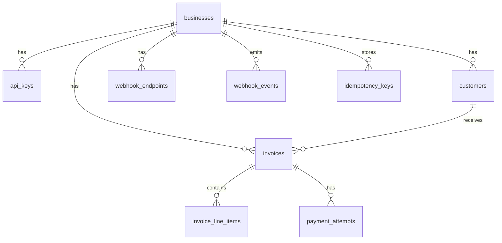
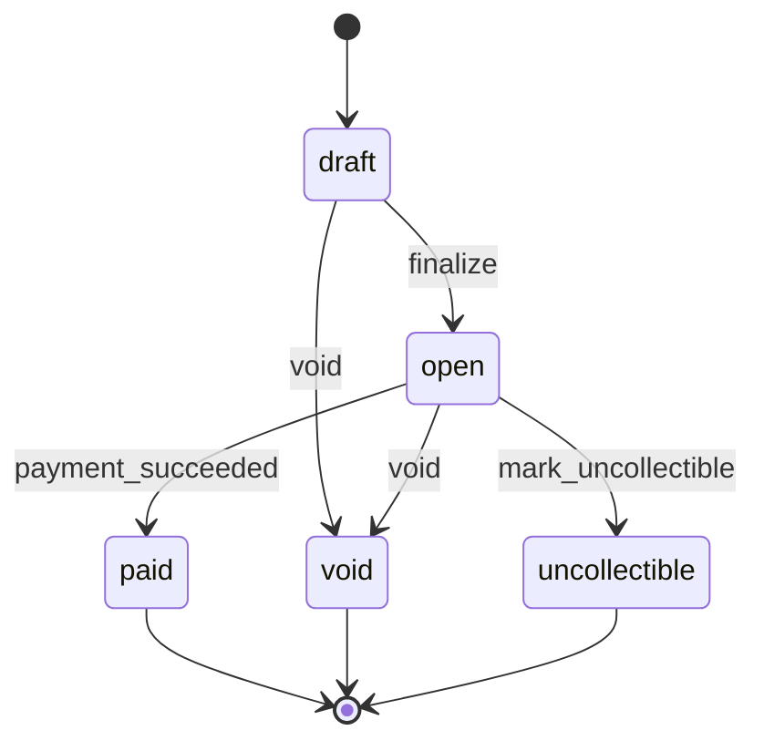

# Design: Dodo Invoice & Payment Service

## 1. Data Model

| Table | Purpose | PK | Notable indexes |
|-------|---------|-----|-----------------|
| `businesses` | Tenant root | UUID | — |
| `api_keys` | Auth (hashed) | UUID | `key_hash` unique |
| `customers` | `(business_id, email)` unique | UUID | `business_id` |
| `invoices` | State, `total_cents` (BIGINT), `due_date` | UUID | `(business_id, state)` |
| `invoice_line_items` | `quantity`, `unit_amount_cents`, computed `line_total_cents` | UUID | `invoice_id` |
| `payment_attempts` | PSP outcome | UUID | partial unique: one `succeeded` per invoice; one `processing` per invoice |
| `idempotency_keys` | `(business_id, idempotency_key)` → stored HTTP response | UUID | unique composite |
| `webhook_endpoints` | Receiver URL + signing secret | UUID | `business_id` |
| `webhook_events` | Outbox for delivery | UUID | pending `(status, next_attempt_at)` |

**Why this shape:** Invoices store server-computed totals so money never depends on client input. Payment attempts are append-only outcome records (not a second ledger). Idempotency and webhook outbox are separate tables so request replay and async delivery do not complicate core invoice rows.

**At 100× scale:** Partition `webhook_events` and `payment_attempts` by time; add read replicas for list/get; consider caching API key verification with short TTL (hash lookup today is O(n) per business for simplicity).

## 2. Invoice State Machine

States: `draft`, `open`, `paid`, `void`, `uncollectible`.

**Triggers implemented in API:** create invoice defaults to `open` (optional `draft` on create). Pay transitions `open → paid` on PSP success. Failed PSP leaves `open`.

**Terminal:** `paid`, `void`, `uncollectible`.

**Invalid transitions:** Handled in domain (`InvoiceState::apply`) and enforced with `UPDATE invoices SET state = $next WHERE id = $id AND state = $expected`. API returns **409** with `invoice_invalid_state` or `invoice_already_paid`.

**Reversible:** None in v1 (no un-pay). `void` from `draft`/`open` is one-way.

## 3. Payment Correctness & Failure Modes

**Mechanism:** `SELECT … FOR UPDATE` on the invoice row inside a transaction, plus partial unique indexes on `payment_attempts` (`one processing`, `one succeeded` per invoice), plus idempotency table keyed by `(business_id, Idempotency-Key)`.

**(a) Two simultaneous POST /pay:** One transaction holds the row lock first, inserts the sole `processing` attempt, commits, and calls the PSP. The second acquires the lock after (or hits the unique index on `processing`) and receives **409 `payment_in_progress`**. After success, only one `succeeded` row can exist. Outcome: at most one charge path succeeds; invoice ends `paid`.

**(b) `tok_timeout` (PSP sleeps 30s):** The handler waits up to `PAY_SYNC_WAIT_SECS` (default 8s) for the background PSP task. If PSP is still pending, the API returns **202 Accepted** with `payment_attempt.status = processing` and invoice still `open`. The background task uses a 35s HTTP client timeout, completes the PSP call, updates attempt + invoice, and enqueues `invoice.paid`. Callers poll `GET /api/v1/invoices/{id}` or rely on webhooks.

**(c) PSP success then crash before persist:** Retry with the **same Idempotency-Key** returns the stored response without a second PSP call once the first attempt completes and idempotency is recorded. If crash happens before PSP call, retry reuses or conflicts on processing row. If crash after PSP but before DB update, retry may call PSP again — production would use PSP idempotency keys; here we document that gap and rely on idempotency record after first successful persist.

**(d) Idempotency key reused with different body:** Request hash mismatch → **422 `idempotency_mismatch`**.

**(e) POST /pay on `paid` invoice:** **409 `invoice_already_paid`** before PSP.

**Why not advisory locks only:** Row lock + conditional update is standard, easy to reason about in Postgres, and pairs naturally with the partial unique indexes. Serializable isolation is heavier; optimistic-only without DB constraints risks double success under races.

## 4. Webhook Design

**Events:** `invoice.created`, `invoice.paid`, `invoice.payment_failed`.

**Signing:** HMAC-SHA256 over `{unix_timestamp}.{raw_json_body}`; header `X-Dodo-Signature: t=<ts>,v1=<hex>`. Receivers should reject stale timestamps (replay window — recommend 5 minutes in production).

**Retry:** On delivery failure, attempts at **1m, 5m, 30m, 2h, 24h** (5 tries). Then status `dead` (logged). Businesses reconcile via `GET /api/v1/invoices/{id}` and optional future event replay API.

**Decoupling:** Handlers insert into `webhook_events` only. A background worker polls due rows and POSTs to registered URLs — never blocks pay/create responses.

## 5. API Key Model

- Generated as long random strings; stored **Argon2-hashed** with a **12-char prefix** for display/logs.
- Transmitted via `X-Api-Key` or `Bearer`.
- Revocation: `revoked_at` column (revocation API not built — document gap).
- Leak blast radius: single business; rotate by inserting new key and revoking old.

## 6. What We Cut and Why

1. **Draft → finalize endpoint** — create-as-`open` covers demos; draft enum kept for state machine completeness.
2. **Refunds / partial payments** — out of scope; would need credit notes and PSP refund IDs.
3. **OAuth / user sessions** — assignment specifies API keys only.
4. **Email notifications** — webhooks only.
5. **Rate limiting** — discussed in prod gaps, not implemented.

## 7. Production Readiness Gaps

1. **Observability** — structured metrics (pay latency, webhook backlog), trace IDs across PSP calls.
2. **Rate limiting & abuse protection** — per-key and per-IP limits on `/pay`.
3. **Audit log** — immutable record of state transitions and key usage for compliance.

Money path uses **integer cents only** (`i64`, checked multiply) — no floats.
